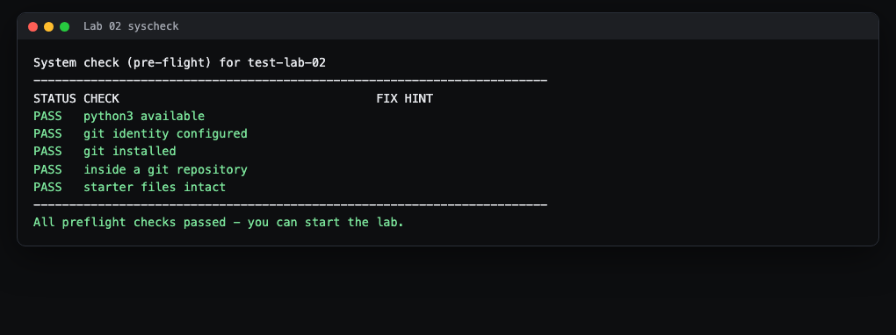
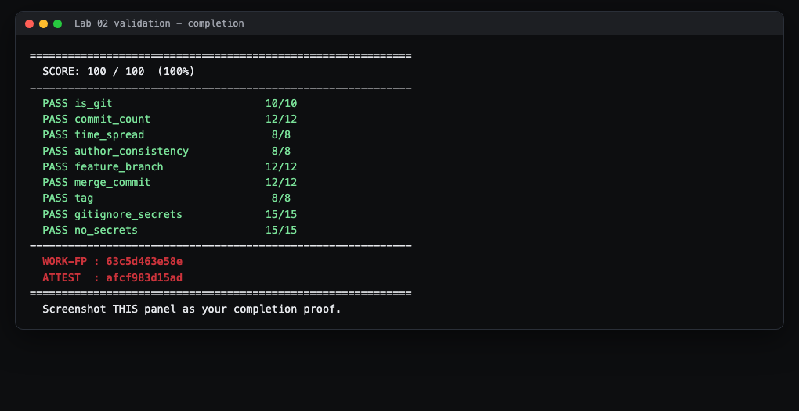
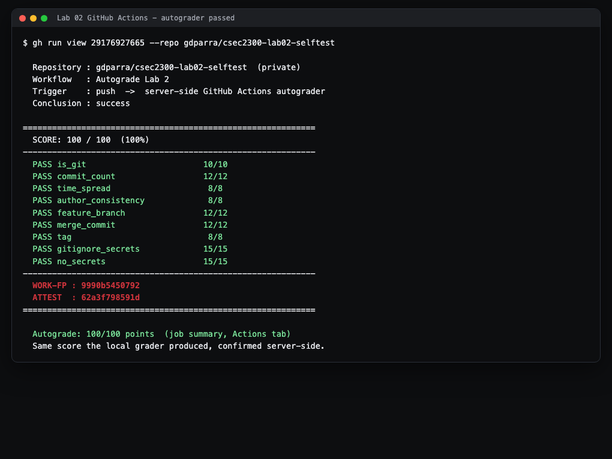

# Lab 2 Student Guide: Git and GitHub Workflow

**Course:** CSEC 2300 Foundations of Cyber Security (UIW) - Dr. Gonzalo D Parra

This guide is written for students who have **never used git before**. It explains
every word and every command. Take it slowly. You cannot break anything by reading.

---

## What you will build and prove

You will turn a folder into a tracked project and record your work as a clean,
professional history: several small saves (commits), a side branch that you merge
back, a version label (tag), and a rule file that keeps secrets (passwords, keys)
out of the project. The autograder reads your project history and awards points for
each of these habits. You are proving that you can work the way security teams
actually work, where every change is reviewed and audited (Course Outcome CO3).

---

## The words you need (read this once)

- **Repository (repo):** a folder that git is watching. It has a hidden `.git`
  subfolder where the full history lives. "Being in a repo" just means you are
  inside that folder.
- **Commit:** a saved snapshot of your files, with a short message describing what
  changed. Think of it as a labeled save point you can always return to. Good work
  is **many small commits**, not one giant one.
- **Branch:** a parallel line of work. `main` is the primary branch. You make a
  `feature/...` branch to try something without disturbing `main`, then combine it
  back later. It is a safe sandbox.
- **Merge:** combining one branch's commits into another. When you merge a feature
  branch into `main`, git records a special **merge commit** that ties the two lines
  together.
- **Tag:** a permanent name pinned to one commit, usually a release like `v1.0`. It
  is a bookmark for "this is the version we shipped."
- **`.gitignore`:** a plain text file listing patterns for files git should never
  track (for example `*.key`). This is how you keep passwords and private keys out
  of the project.

If any of these still feel abstract, spend fifteen minutes on the two practice
sites before you touch the graded work. They are the fastest way to make branches
and merges click:

- https://learngitbranching.js.org/  (drag-and-drop branch and merge visualizer)
- https://gitmastery.me/  (short guided git exercises)

---

## Before you start

- **Finish Lab 0 first.** Lab 0 sets your git identity (name and email) and your SSH
  key. This lab assumes both are already done.
- **Where the real instructions live:** the Lab 2 assignment on Canvas contains the
  **repository invitation** and the authoritative `README.md`. If a hint here
  and the README ever disagree, the README wins.
- **If you get stuck:** open `HINTS.md` in the repo. It has three tiers, from a gentle
  nudge to a near-complete example. Use the smallest hint that unblocks you.
- **You are on Windows?** Use **Git Bash** (installed with Git for Windows) for every
  command below. It gives you the same `bash` shell the commands are written for.
  Open the Start menu, type "Git Bash", and press Enter.

---

## Step 1 - Accept and open the lab

1. Click the **repository invitation** from the Canvas assignment. Accept it.
   Your instructor creates a private repository for you with the starter files in it.
   **That repository is already a git repo** - you do not run `git init` yourself.
2. On your new repo's GitHub page, click the green **Code** button, choose **SSH**,
   and copy the address (it looks like `git@github.com:...`).
3. In Git Bash, clone (download) it and step into the folder:

```bash
git clone git@github.com:YOUR-ORG/lab-02-git-github-workflow-YOURNAME.git
cd lab-02-git-github-workflow-YOURNAME
```

- `git clone <address>` copies the whole repo, history and all, to your computer.
- `cd <folder>` means "change directory" - it moves you inside that folder so the
  next commands run in the right place.

> **what you'll see:** git prints `Cloning into '...'` and a few lines about objects.
> After `cd`, your prompt shows the folder name. You are now "inside the repo."

---

## Step 2 - Run the system check first

Before doing any work, confirm your environment is ready:

```bash
bash autograde/run.sh --syscheck
```

- `bash` runs a script. `autograde/run.sh` is the checker script. `--syscheck` tells
  it to run the pre-flight (environment) checks instead of grading.

> **what you'll see:** a table like this, all rows saying `PASS`:



If any row says **FAIL**, fix it with the hint in that row, then run the command
again:

- **git identity configured = FAIL:** you skipped Lab 0. Set it once, globally:
  ```bash
  git config --global user.name "Your Name"
  git config --global user.email "you@example.com"
  ```
- **inside a git repository = FAIL:** you are not inside the cloned folder. Run `cd`
  into it (see Step 1). Your assignment repository is already a git repo, so you should never need
  `git init` here.
- **git installed = FAIL:** install Git for Windows from https://git-scm.com and
  reopen Git Bash.
- **starter files intact = FAIL:** you deleted a starter file. Re-clone a fresh copy.

Do not move on until every row is PASS.

---

## Step 3 - Understand what the grader wants

The grader awards 100 points across nine habits. You are aiming to satisfy all nine:

| What it checks | How you satisfy it |
|----------------|--------------------|
| It is a git repo | Automatic (your assignment repo) |
| At least 8 commits | Make many small commits (Step 4) |
| Commits span 2+ clock hours | Do the work in real sittings, not one dump (Step 4) |
| One consistent author | Use the same identity from Lab 0 the whole time |
| A `feature/...` branch exists | Step 5 |
| A merge commit exists | Step 6 |
| At least one tag | Step 7 |
| `.gitignore` blocks secret patterns | Step 8 |
| No secrets committed | Step 8 |

You do not need to memorize this. Just follow Steps 4 through 8.

---

## Step 4 - Do real, incremental work (8+ commits, spread over time)

The `WORKLOG.md` file exists so you have something real to edit and commit. The
professional habit this teaches is: **make a small change, save it, describe it,**
repeat. One giant commit at the end is what the grader flags as suspicious.

The save loop, three commands you will use over and over:

```bash
git add WORKLOG.md
git commit -m "docs: note what I just changed"
git status
```

**Anatomy of each command:**

- `git add <file>` - **stage** the file. Staging means "include this change in my
  next commit." You are choosing what goes into the snapshot.
- `git commit -m "message"` - **save** the staged changes as one commit. The `-m`
  flag attaches the message inline. Write it as `type: short summary`, for example
  `docs:`, `feat:` (a feature), `chore:` (housekeeping). Present tense, under ~60
  characters.
- `git status` - **show** what is staged, unstaged, or untracked. Run it whenever you
  are unsure what state you are in. It is safe and read-only.

> **what you'll see** after a commit: a line like
> `[main a1b2c3d] docs: note what I just changed` and `1 file changed`.

**Reaching 8 commits over 2+ hours the honest way:** genuinely spread the lab across
at least two sittings in different clock hours (for example some work before lunch,
some after). Add a real line to `WORKLOG.md` each time you make a meaningful change,
then commit it. Eight to ten small commits is a normal, healthy history for this lab.
Do not fake timestamps; do the work in real sessions and the "2 distinct hours" check
takes care of itself.

To see your history at any time:

```bash
git log --oneline
```

> **what you'll see:** one line per commit, newest at top, each with a short id and
> your message. This is your project's story.

---

## Step 5 - Create a feature branch and work on it

You will move risky or experimental work onto a side branch so `main` stays clean.

```bash
git switch -c feature/secrets-hygiene
```

- `git switch -c <name>` - **create** a new branch and move onto it in one step. The
  `-c` means "create." The name must start with `feature/` for the grader to see it.
  Everything you commit now lands on this branch, not on `main`.

Make a couple of real commits here. For example, add a small file that reads
configuration from the environment instead of from a committed file, and commit it,
then add a short `SECURITY.md` note and commit that too. Use the same add/commit loop
from Step 4. Two or three commits on the branch is plenty.

Check which branch you are on any time:

```bash
git branch
```

> **what you'll see:** a list of branches with a `*` next to the one you are on.

---

## Step 6 - Merge the feature branch back into main

Now combine your branch's work into `main` and record the merge.

```bash
git switch main
git merge --no-ff feature/secrets-hygiene -m "merge: integrate secrets-hygiene into main"
```

- `git switch main` - move back onto the `main` branch. (No `-c` this time, because
  `main` already exists.)
- `git merge --no-ff <branch>` - pull the branch's commits into `main`. The
  `--no-ff` flag ("no fast-forward") **forces git to record a real merge commit** so
  the history clearly shows a branch was merged. This is exactly what the grader
  looks for. `-m` gives the merge commit its message.

> **what you'll see:** `Merge made by the 'recursive' strategy` (or similar) and a
> summary of the files that came over from the branch.

**Avoiding a merge conflict:** a conflict happens when both branches changed the
**same lines** of the same file. To sidestep it in this lab, edit `WORKLOG.md` only
on `main`, and have your feature branch add **new** files instead. If a conflict does
happen, git marks the spots with `<<<<<<<`, `=======`, `>>>>>>>`. Open the file,
delete those marker lines and keep the text you want, then `git add` the file and
`git commit` to finish the merge. Never leave marker lines in a committed file.

Keep the feature branch after merging (do not delete it) so the grader can still see
it existed.

---

## Step 7 - Tag a release

A tag pins a friendly name to the current commit.

```bash
git tag -a v1.0 -m "release v1.0: clean workflow with secrets hygiene"
```

- `git tag -a <name>` - create an **annotated** tag (the `-a`), which stores who made
  it and when. Plain lightweight tags work too, but annotated is the professional
  default. `-m` is the tag's message.

Confirm it:

```bash
git tag
```

> **what you'll see:** `v1.0` printed on its own line.

---

## Step 8 - Secrets hygiene (this is graded twice)

Two rules: (a) your `.gitignore` must list secret patterns, and (b) no actual secret
may be sitting in the project where the scanner walks the folder.

**(a) Edit `.gitignore`** so it includes these patterns (see `HINTS.md` Tier 3 for the
exact block). A `.gitignore` line like `*.key` means "never track any file ending in
`.key`." Your file should cover at least env files, PEM files, key files, and a
`secrets/` folder. Then commit it:

```bash
git add .gitignore
git commit -m "chore: add secret patterns to .gitignore"
```

**(b) Never put a real secret in the folder.** If you create a local credentials file
to test with, keep it inside the git-ignored `secrets/` folder and fill it with
placeholder text, not a real key. Confirm git is ignoring it:

```bash
git check-ignore secrets/service.env
git status
```

- `git check-ignore <path>` prints the path back if it is being ignored (silence
  means it is **not** ignored - fix your `.gitignore`).
- `git status` should **not** list your secret file under changes to commit. If it
  does, it is not ignored yet.

> **Why this matters:** committed private keys and API keys are one of the most common
> real-world breaches. The grader scans your project folder for private-key blocks and
> `API_KEY=sk-...` style literals. Keep them out entirely, even in ignored files, and
> use harmless placeholders when you need an example.

---

## Final step - Validate and capture your proof

Run the full grader:

```bash
bash autograde/run.sh
```

> **what you'll see:** a JSON report listing each criterion with its points, then a
> total, then two codes on their own lines: **WORK-FP** and **ATTEST**. A finished run
> looks like this:



Read the per-criterion `feedback` lines. Any criterion scoring below its max tells you
exactly what to fix; go back to the matching step above, fix it, and run the grader
again. Repeat until `"total": 100`.

**Capture your proof:** take a screenshot of the terminal showing the final score and
the **WORK-FP** and **ATTEST** lines. That screenshot is what you submit. On Windows,
press `Windows + Shift + S` to grab the terminal region.

**Push your work to GitHub** so the online autograder also runs:

```bash
git push --all
git push --tags
```

- `git push --all` uploads every branch (`main` and your `feature/...` branch).
- `git push --tags` uploads your `v1.0` tag. Tags do not go up with `--all`, so this
  second command is required.

> **what you'll see:** git lists the branches and tags it sent. On your repo's GitHub
> page, the **Actions** tab will show the autograder running and its score.

---

## Submitting on GitHub (what you will see)

The same grader that ran on your computer also runs on GitHub, on GitHub's own
servers, every time you push. This is the copy Dr. Gonzalo D Parra reads for your
grade, so it is worth knowing exactly what a passing submission looks like online.

1. **Accept the assignment.** Open the repository invitation for Lab 2 on
   Canvas and click **Accept this assignment**. GitHub creates a private repository
   for you and gives you its clone URL. Clone it, do all the work from this guide
   inside that folder, and commit as you go.

2. **Push every branch and every tag.** A single `git push` sends only your current
   branch, and tags never travel automatically. Send all of it:

   ```bash
   git push origin --all
   git push origin --tags
   ```

   - `--all` uploads `main` and your `feature/...` branch.
   - `--tags` uploads your `v1.0` tag. This second command is required; without it
     the online grader reports **0** for the `tag` and `feature_branch` checks even
     though they pass on your machine.

3. **Open the Actions tab.** On your repository page on GitHub, click **Actions**.
   You will see a workflow named **Autograde Lab 2** with a run for your push. A
   spinning yellow dot means it is still grading; wait for it to finish.

   > **what you'll see:** the run turns into a green check when it passes. Click the
   > run, then the **grade** job, to read the full per-criterion panel and the
   > **Autograde: 100/100 points** summary at the top.

4. **Confirm the score matches.** The server prints the very same panel you saw
   locally, with the identical **WORK-FP** and the same per-criterion points. A
   finished, passing online run looks like this:

   

   If the green check shows the same score you captured on your computer, your
   submission is complete. If the online run is lower, re-read step 2; a missing
   `git push origin --tags` is the most common cause.

---

## Troubleshooting (the usual stumbles for this lab)

1. **"time_spread" scores 0** - all your commits landed in one clock hour, which reads
   as a single bulk dump. Do the remaining work in a later sitting and add a few more
   real commits so your history spans at least two hours.
2. **"merge_commit" scores 0** - you merged without `--no-ff`, so git fast-forwarded
   and left no merge commit. Make a fresh tiny commit on a new `feature/...` branch and
   merge again **with** `--no-ff`.
3. **"feature_branch" scores 0** - your branch name does not start with `feature/`, or
   you deleted it after merging. Recreate it as `feature/<name>` and keep it.
4. **"gitignore_secrets" scores 0** - your `.gitignore` is missing the patterns. Open
   `HINTS.md` Tier 3 and add the exact block, then commit `.gitignore`.
5. **"no_secrets" scores 0** - a file in your folder contains something that looks like
   a private key or an `API_KEY=sk-...` literal. Replace it with a placeholder or
   delete it. Ignoring the file is **not** enough; the scanner walks the folder, so the
   real value must not be present at all.
6. **"author_consistency" scores low** - you committed under two different emails. Set
   your identity once with `git config --global user.email "..."` and use it for all
   commits.
