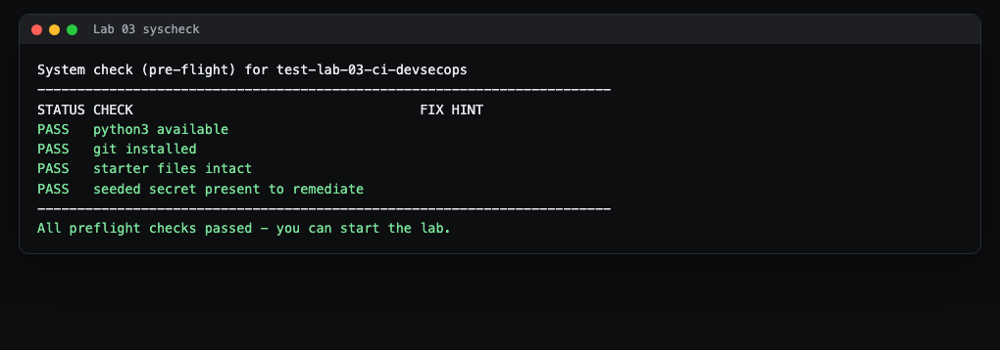
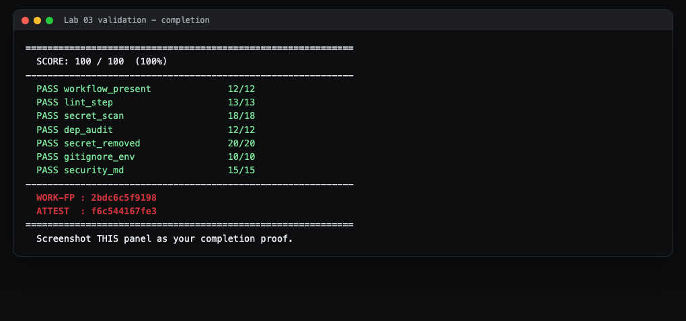
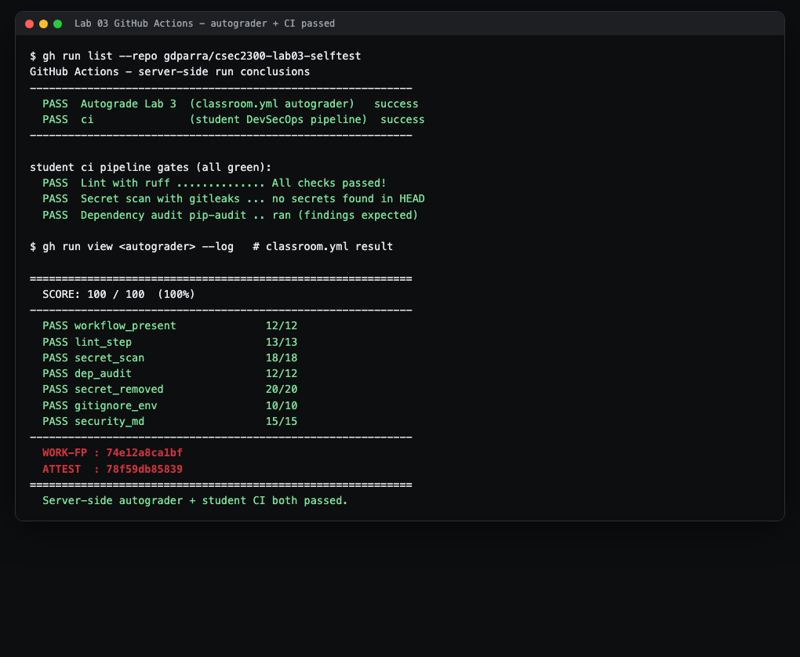

# Lab 3 Student Guide: CI / DevSecOps Pipeline

Course: CSEC 2300-01 Foundations of Cyber Security (UIW) - Dr. Gonzalo D Parra

## What you will build and prove

You will build an automated **security pipeline** that runs every time code is
pushed to GitHub. It runs three checks: a **linter**, a **secret scanner**, and
a **dependency audit**. You will also fix a real problem the starter code has:
an API key was accidentally committed to the repository. You will remove it,
tell git to ignore secret files going forward, and write a short security note
explaining that the leaked key was rotated (replaced), not just deleted.

When you finish, `bash autograde/run.sh` should show **100/100** with a
WORK-FP and ATTEST code, which is the proof you submit.

## Before you start

- Finish Lab 2 first. You should be comfortable with `git add`, `git commit`,
  and `git push`.
- The authoritative instructions live in the **Lab 3 assignment on Canvas**:
  the repository invitation and the `README.md` in your repository.
- If you get stuck, open `HINTS.md`. It has a three-tier hint ladder (a nudge,
  then guided help, then a near-solution). Use the smallest hint that unblocks
  you.
- This guide teaches you the **process and the tools**. It does not hand you
  the graded answers. That is on purpose. You learn security by doing it.

### A one-minute vocabulary primer

- **CI (Continuous Integration):** a robot that automatically runs checks on
  your code every time you push. Instead of you remembering to run tests, the
  server does it for you and reports back pass or fail.
- **DevSecOps:** the practice of building security checks **into** that robot,
  so problems are caught automatically as part of normal development. People
  call this "shifting security left" (catching issues early, on the left side
  of the timeline, instead of after shipping).
- **GitHub Actions:** GitHub's built-in CI robot. You tell it what to do by
  writing a **workflow file** (a `.yml` file) inside `.github/workflows/`.
- **Workflow file:** a plain-text recipe, written in YAML, that lists the
  steps the robot should run.

## Step 1: Accept and open the lab

1. Click the repository invitation from Canvas and accept the
   assignment. GitHub creates a private repository just for you.
2. Copy the repository's clone URL (the green **Code** button on the repo page).
3. On your computer, open a terminal (on Windows, use **Git Bash**, which was
   installed with Git) and run:

   ```bash
   git clone <the-URL-you-copied>
   cd lab-03-ci-devsecops
   ```

   > What you'll see: git downloads the files and drops you into the lab folder.
   > Run `ls` (or `dir`) and you should see `README.md`, `autograde/`, and a
   > `starter/` folder.

## Step 2: Run the system check first

Before doing any work, confirm your environment is ready:

```bash
bash autograde/run.sh --syscheck
```

> What you'll see:



Every row should say **PASS**. If a row says FAIL, the last column tells you
how to fix it:

| If this FAILs | Do this |
|---|---|
| `python3 available` | Install Python 3 and reopen your terminal so it is on your PATH. |
| `git installed` | Install Git for Windows (Git Bash) and reopen the terminal. |
| `starter files intact` | You deleted a starter file by accident. Restore it with `git checkout -- starter/app/config.py`. |

This lab needs only Python and Git. No Docker required.

## Step 3: Understand the problem you are fixing

Open `starter/app/config.py`. You will see a line that hardcodes an API key
directly in the source, plus a stray `.env` file that also holds the key.
**This is the bug.** A secret written into source code gets copied to every
clone, every fork, and GitHub's servers. Anyone who can read the repo can read
the key.

The rule: **secrets never belong in source code.** They belong in
**environment variables** or an encrypted secret store, read in at run time.

## Step 4: Write the CI workflow

Create a new file at `.github/workflows/ci.yml`. This is separate from the
`classroom.yml` autograder that is already there. Do not edit `classroom.yml`.

A workflow file has a few required parts. Here is the shape (see `HINTS.md`
Tier 3 for the specific step contents you need):

```yaml
name: ci
on: [push, pull_request]      # WHEN the robot runs
jobs:
  security:                   # a named job
    runs-on: ubuntu-latest    # WHICH machine it runs on
    steps:                    # WHAT it does, top to bottom
      - uses: actions/checkout@v4      # step that uses a prebuilt action
      - name: lint
        run: <a shell command>         # step that runs a shell command
```

How to read that structure:

- **`on:`** is the trigger. `[push, pull_request]` means "run on every push and
  on every pull request."
- **`jobs:`** holds one or more jobs. Each job runs on a fresh cloud machine.
- **`runs-on:`** picks the machine image. `ubuntu-latest` is a standard Linux
  runner GitHub provides for free.
- **`steps:`** is an ordered list. Each step is either `uses:` (run a prebuilt
  action someone else published) or `run:` (run a shell command). Steps run
  top to bottom; if one fails, the run turns red.

You must include three security steps:

1. **Linter** (for example `ruff`, `flake8`, `hadolint`, or `eslint`). A linter
   reads your code without running it and flags style problems, likely bugs,
   and suspicious patterns. This is a light form of **SAST** (Static
   Application Security Testing).
2. **Secret scanner** (`gitleaks`). It searches your files and git history for
   things that look like passwords, tokens, and API keys, using known key
   formats and high-entropy (random-looking) string detection. This is the
   check that would have caught the seeded key.
3. **Dependency audit** (`pip-audit`, `npm audit`, or `safety`). It reads your
   dependency list and cross-references it against a database of known
   vulnerabilities (CVEs) in those exact versions. Old libraries often have
   published security holes; this tells you which ones to upgrade.

> What you'll see when these actually run (this lab's steps run cleanly on your
> own machine too):
>
> ```
> Lint (ruff):            All checks passed!
> Dependency audit:       Found 5 known vulnerabilities in 2 packages
>                         requests 2.31.0 ... flask 2.0.0 ...
> ```
>
> The dependency audit finding is expected. The starter pins deliberately old
> versions so you can see what a real vulnerability report looks like. Your job
> for this lab is to have the audit **run**, not to reach zero findings.

## Step 5: Remove the seeded secret

1. Edit `starter/app/config.py` so the key is read from an environment variable
   instead of being written in the file. `HINTS.md` Tier 3 shows the exact
   one-liner. The idea: `os.environ.get("API_KEY", "")`.
2. Delete the committed `.env` file and tell git about the deletion:

   ```bash
   git rm .env
   ```

   > What you'll see: `rm '.env'`. The file is now staged for deletion.

3. Confirm the secret is truly gone from your working files:

   ```bash
   grep -rl "sk-live" . --exclude-dir=.git --exclude-dir=autograde
   ```

   > What you'll see: nothing at all. No output means no match, which is what
   > you want. (The grader ignores the `autograde/` folder, so a copy of the
   > pattern living inside the grader itself does not count against you.)

## Step 6: Stop it from happening again (.gitignore)

Open `.gitignore` and add a line with `.env` on it. `.gitignore` is a list of
file patterns git should never track. With `.env` listed, git will refuse to
stage a future `.env`, so a teammate cannot re-commit the same mistake.

## Step 7: Write SECURITY.md

Create a file named `SECURITY.md` in the repo root. In plain language, document
that the leaked key was **rotated / revoked** (turned off at the provider and
replaced with a new one). Explain **why rotation is the real fix** and why you
did **not** try to scrub git history.

The key lesson: once a secret has been pushed to a shared server, assume it is
compromised forever. Deleting it from the latest commit does not un-leak it,
because old clones and caches still have it. The only thing that actually
protects you is **making the old key worthless** by rotating it. Use words like
*rotate*, *revoke*, *re-issue*, or *invalidate* so it is clear you understand
this.

## Final step: Validate and capture your proof

Run the grader:

```bash
bash autograde/run.sh
```

Read the per-criterion table. Each line shows points earned out of the max and
a short reason. Aim for **100/100**. When you get there, you will see your
**WORK-FP** and **ATTEST** codes at the bottom. Take a screenshot of this whole
result (the score block plus both codes) and submit it as directed on Canvas.

> A finished run looks like this:



### Red run vs green run on GitHub

After you `git push`, open your repository on GitHub and click the **Actions**
tab. Each push shows a run:

- A **green check** means every step passed. Your pipeline is healthy.
- A **red X** means a step failed. Click the run, then click the failed step to
  expand its log. The log reads top to bottom; scroll to the first red error
  line. For example, if the secret scanner turns the run red, its log will name
  the file and line where it found a key, exactly like this local preview:

  ```
  .env:2:API_KEY=sk-live-...        <- a RED run: the scanner found a secret
  starter/app/config.py:5:API_KEY = "sk-live-..."
  ```

  Fix the reported problem, commit, and push again. The pipeline re-runs
  automatically and should go green.

> Note: the live GitHub Actions run is graded separately and needs your pushed
> repository. The `bash autograde/run.sh` score above is the local proof you
> submit. Both come from the same three security gates.

## Submitting on GitHub (what you will see)

The local `bash autograde/run.sh` score is your offline proof. When you push to
your assignment repository, GitHub runs the checks again on its own
servers, and you can watch them live. Two separate workflows run on every push:

1. **The autograder** (`classroom.yml`, named "Autograde Lab 3"). This is the
   graded pipeline your instructor sees. It runs the same `autograde/run.sh` and
   posts your score.
2. **Your own pipeline** (`ci.yml`, named "ci"). This is the DevSecOps pipeline
   you built: the linter, the secret scan, and the dependency audit.

### Step by step

1. **Push your work.**

   ```bash
   git add -A
   git commit -m "Complete Lab 3: CI pipeline + secret rotation"
   git push
   ```

2. **Open the Actions tab.** On your repository page on GitHub, click
   **Actions**. You will see your push listed with **both** workflows running.
   A spinning amber dot means "in progress"; a green check means "passed"; a red
   X means "a step failed".

3. **Wait for both to go green.** Give it a minute. Both "Autograde Lab 3" and
   "ci" should finish with a green check.

   - If your **ci** pipeline is red, click it, open the red step, and read the
     first error. A common cause is a linter finding in your app code, or a
     secret the scanner detected in what you shipped. Fix it, commit, and push
     again; the run repeats automatically.
   - If the **autograder** is red or below 100, open its run and read the job
     summary (next step) to see which criterion missed.

4. **Read your score in the job summary.** Click the **Autograde Lab 3** run,
   then click the **Summary** at the top left. GitHub prints a table:
   `Autograde: 100/100 points`, one line per criterion, and your **WORK-FP** and
   **ATTEST** codes. That summary is the server-side proof of your grade.

> What a finished submission looks like: both workflows green, and the
> autograder reporting a perfect score with its verification codes.



Note: the secret scanner in your `ci` pipeline checks the files you actually
ship (your current HEAD), which is clean once you have removed the key. The old
leaked commit stays in history on purpose. The real protection is that the key
was **rotated**, as you documented in `SECURITY.md`. That is why the pipeline
can pass while the history still records what happened. This is the whole
lesson of the lab, straight from Dr. Gonzalo D Parra: rotate the secret, do not
try to scrub history.

## Troubleshooting

1. **Grader says "no CI workflow found."** Your file must be at exactly
   `.github/workflows/ci.yml`. Check spelling and that it is not inside
   `starter/`. The folder starts with a dot.
2. **Grader still says the secret is present.** You edited `config.py` but did
   not delete `.env`, or the other way around. The key lives in both. Run the
   `grep` from Step 5 to find every remaining copy.
3. **Linter / secret-scan / dep-audit step "not detected."** The grader looks
   for the tool names in your workflow text (for example `ruff`, `gitleaks`,
   `pip-audit`). If you used a different tool, make sure it is one of the
   accepted names listed in the `README.md` grading section.
4. **`.gitignore` credit but you did not add `.env`.** Do not rely on the
   starter's TODO comment. Add a real `.env` line so a future `.env` is
   actually ignored. This is the point of the task.
5. **YAML errors on GitHub (red run before any step logs).** YAML is
   indentation-sensitive. Use spaces, never tabs, and keep the two-space
   indentation consistent. Paste your file into GitHub's Actions tab error
   message to see the line it complains about.
