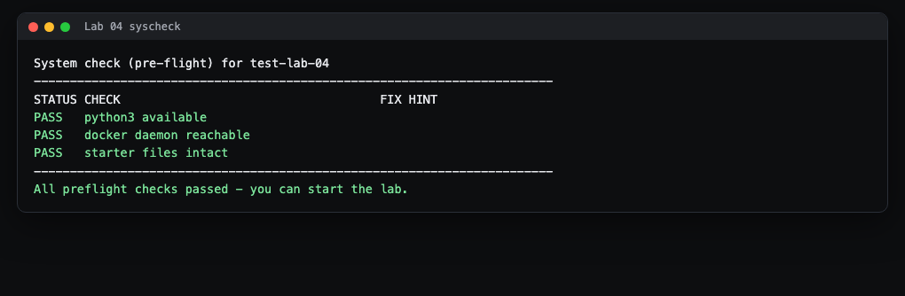
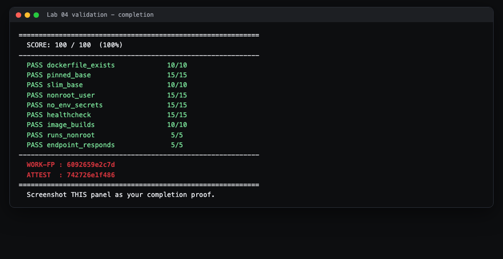

# Lab 4 Student Guide: Docker Hardening

**Course:** CSEC 2300 Foundations of Cyber Security (UIW) - Dr. Gonzalo D Parra

This is a friendly, step-by-step walkthrough. It assumes you have never used
Linux or Docker before. It teaches you the process and the tools. It does NOT
hand you the answers. The exact instructions you are graded on live in
`README.md` (the tasks and the grading table) and `HINTS.md` (a three-tier hint
ladder). Keep both open while you work.

---

## What you will build and prove

You are given a deliberately insecure container recipe (a `Dockerfile`). Your
job is to harden it so it follows least-privilege and minimal-image practices,
then prove your work by running the autograder until it reports 100 out of 100.
When you finish you will submit a screenshot showing your score plus two
verification codes (WORK-FP and ATTEST).

### First, two words you need

- An **image** is a frozen, read-only template: an operating system plus your
  app, packaged so it runs the same way on any machine. Think of it as a recipe
  that has already been cooked and vacuum-sealed.
- A **container** is a running copy of an image. You can start many containers
  from one image. Think of it as a single meal served from that sealed recipe.

A `Dockerfile` is the plain-text list of instructions Docker reads to *build*
an image. Every hardening change you make in this lab is one edited line in the
`Dockerfile`.

### Why this matters

Container images are production attack surface. If a container runs as the
all-powerful `root` user, an attacker who breaks into your app inherits those
powers. If you bake a password into the image, anyone who pulls the image can
read it. Pinning a small, specific base image means fewer programs to attack and
a build that behaves the same every time. This maps to CO1 and CO2 and to
Security+ SY0-701 Domain 3.0 (secure baselines and containers).

---

## Before you start

Prerequisites:

- **Docker Desktop** installed and running. On Windows, open the Start menu,
  launch **Docker Desktop**, and wait until its whale icon in the system tray
  stops animating. The autograder can still parse your `Dockerfile` without
  Docker, but three of the nine checks actually build and run your image, so
  turn Docker on to earn full marks locally.
- **Git** installed, so you can accept and clone the assignment.
- The authoritative instructions are the **Lab 4 assignment on Canvas**: it
  contains your **your GitHub assignment repository** invite link and points at this repo's
  `README.md`. Use `HINTS.md` when you get stuck; it escalates from a nudge to a
  near-solution so you can take only as much help as you need.

A note on typing commands: on Windows use **Git Bash** or **PowerShell**. The
commands below start with `bash autograde/run.sh`, which works in Git Bash and
in the terminal inside Docker Desktop. If `bash` is not found, open Git Bash.

---

## Step 1: Accept and open the lab

1. Click the **your GitHub assignment repository** link in the Canvas assignment and accept it.
   GitHub creates a private copy of the lab just for you.
2. Copy the repository web address (the green **Code** button gives you an
   HTTPS URL).
3. In your terminal, clone it and move into the folder. Replace the URL with
   your own:

   ```bash
   git clone https://github.com/UIWCyber/csec2300-lab04-YOURNAME.git
   cd lab-04-docker-hardening-YOU
   ```

`cd` means "change directory." You are now standing inside the lab folder, which
is where every command in this guide expects to be run.

---

## Step 2: Run the system check first

Before touching anything, confirm your machine is ready:

```bash
bash autograde/run.sh --syscheck
```

> **What you'll see:** a small table with a STATUS column. Every row should say
> `PASS`.



The three rows and how to fix a FAIL:

- **python3 available** - Python runs the grader. If this fails, install Python
  3 and reopen your terminal.
- **docker daemon reachable** - If this says FAIL, Docker Desktop is not running.
  Launch it and wait for the whale icon to settle, then re-run the check. (You
  can still do the whole lab and earn most points with Docker off, but you want
  this green to test the build locally.)
- **starter files intact** - The `Dockerfile` and `app/server.py` must still be
  present. If you deleted one, restore it from the original repo.

Fix any FAIL, then re-run the same command until all three say PASS.

---

## Step 3: Look at the sloppy starter and grade it once

Open the `Dockerfile` in the repo root and read it top to bottom. The comments
in it literally list what is wrong. Then grade the untouched starter so you can
watch your score climb later:

```bash
bash autograde/run.sh
```

> **What you'll see:** a block of JSON. Near the top is `"total"`. The starter
> scores very low (only the "Dockerfile present" check passes). Each criterion
> has a `"feedback"` line telling you exactly what is missing. Read every one;
> that feedback is your to-do list.

This proves the grader can tell a hardened file from a sloppy one, and it gives
you a baseline to beat.

---

## Step 4: Understand each instruction, then harden it

You will edit the `Dockerfile` so each weakness becomes a strength. Here is what
each kind of line does, so you know *why* you are changing it. The exact tags
and directives to use are in `README.md` (Tasks) and `HINTS.md` (Tiers 1 to 3).

- **`FROM ...`** picks the base image everything else sits on. The starter uses a
  moving, oversized base. Your job (Task 1): pin it to a **specific, slim** tag
  so the build is reproducible and small. `HINTS.md` Tier 2 names good choices.
  Rule: never leave it on `:latest`.
- **`ENV NAME=value`** sets an environment variable that is baked into every
  layer of the image. The starter bakes an API key and a database password this
  way, which means they ship inside the image for anyone to read. Task 3: delete
  the secret `ENV` lines. Real secrets are passed in at run time instead, for
  example with `docker run --env API_KEY=...`. It is fine to keep a non-secret
  variable like the port.
- **`RUN ...`** executes a command while building the image (installing packages,
  creating a user). You will use a `RUN` line to create an ordinary,
  unprivileged user. `HINTS.md` Tier 3 shows the shape of that command.
- **`COPY app/ /app/`** copies your application files into the image. Prefer
  `COPY` over `ADD` (Task 5): `ADD` has surprising behavior with URLs and
  archives, so `COPY` is the safer default. The starter already uses `COPY`.
- **`WORKDIR /app`** sets the folder later commands run in. Leave it.
- **`USER ...`** chooses which user the container runs as. With no `USER` line, a
  container runs as `root`. Task 2: add a `USER` line naming the non-root user
  you created, placed *after* you create that user, so the app drops root
  privileges before it starts.
- **`HEALTHCHECK ...`** tells Docker how to test that your app is actually alive.
  The starter has none. Task 4: add one that probes the app's `/health` path.
  `HINTS.md` Tier 3 shows the skeleton. Tip: the base image already includes an
  interpreter you can use for the probe, so you do not need to install extra
  tools.
- **`CMD [...]`** is the command that starts your app when the container runs.
  Leave the app's start command working; hardening must not break the app.

The one hard constraint: the little server in `app/server.py` listens on a port
(it reads the `PORT` variable, default 8080) and answers `/health` with the word
`ok`. Whatever you change, the container must still start that server and still
answer `/health`. If you break that, the last graded check will tell you.

Edit the file, save it.

---

## Step 5: Build your image and read the output

Now turn your recipe into an image. From the lab folder:

```bash
docker build -t my-lab04 .
```

The `-t my-lab04` gives your image a name. The `.` at the end means "use the
`Dockerfile` in this current folder." Do not forget the dot.

> **What you'll see:** a series of numbered steps, one per instruction, each
> ending in `DONE`. The final lines say `naming to ... my-lab04` and
> `writing image`. That means success. If a step ends in `ERROR`, read the red
> text: it usually names the exact line and problem (a typo in a tag, a package
> that does not exist). Fix that line and run `docker build` again. Docker
> reuses cached steps, so the second build is faster.

Then start a container from your image and check it by hand:

```bash
docker run --rm my-lab04 id -u
```

> **What you'll see:** a number. If it is `0`, your container is still running as
> root and you need your `USER` line. Any other number (for example a high UID)
> means you successfully dropped root.

To confirm the app still serves `/health`, run it and probe it. This guide uses
host port **8404** so it will not clash with anything else:

```bash
docker run -d --name lab04-test -p 8404:8080 my-lab04
curl http://localhost:8404/health
```

> **What you'll see:** `ok`. That is the app answering. `-d` runs it in the
> background, and `-p 8404:8080` forwards your machine's port 8404 to the app's
> port 8080 inside the container.

Clean up your hand-test container when done:

```bash
docker rm -f lab04-test
```

---

## Step 6: Validate and capture your proof

Run the grader again:

```bash
bash autograde/run.sh
```

> **What you'll see:** the same JSON as before, but now `"total": 100`. Each of
> the nine criteria shows `"points"` equal to its `"max"`, with feedback like
> `final USER is non-root` and `container served /health = 'ok' after
> hardening`. At the very bottom are two lines:
>
> ```
> WORK-FP  : xxxxxxxxxxxx
> ATTEST   : xxxxxxxxxxxx
> ```

**WORK-FP** is a fingerprint of your `Dockerfile` content. **ATTEST** is a
signed record of this exact run. Together they are your submission proof.

Take a screenshot of the result showing the per-criterion scores, the total, and
those two codes. A finished run looks like this:



Submit that screenshot where the Canvas assignment asks, and push your hardened
`Dockerfile` back to your GitHub assignment repository:

```bash
git add Dockerfile
git commit -m "Harden Dockerfile"
git push
```

If any of the last three checks (`image_builds`, `runs_nonroot`,
`endpoint_responds`) say **"skipped (environment unavailable)"**, that only means
Docker was not running on your machine. Those three are graded on the lab
workstations, so it is acceptable, but starting Docker Desktop lets you confirm
100 yourself before you submit.

---

## Troubleshooting

- **`docker: command not found` or "docker daemon unreachable".** Docker Desktop
  is not installed or not started. Open it, wait for the whale icon to settle,
  and re-run `bash autograde/run.sh --syscheck`.
- **`docker build` fails on the `FROM` line.** You likely mistyped the base image
  tag. Copy the exact tag from `HINTS.md` Tier 2, and make sure you did not leave
  it as `:latest`.
- **`nonroot_user` still fails.** Your `USER` line must come *after* the `RUN`
  line that creates the user, and it must name that user (not `root` and not
  `0`). Order matters.
- **`endpoint_responds` fails after hardening.** Your non-root user may not be
  able to read the app files, or you changed the port the app listens on. Keep
  the app listening on its default port and make sure the copied files are
  readable by the user you switched to. Re-run `docker build` then the grader.
- **`bash: command not found` on Windows.** Use Git Bash rather than the plain
  Command Prompt.

---

That is the whole lab: read the sloppy file, understand each line, harden it,
build and run to prove it works, then validate to 100 and submit your screenshot.
