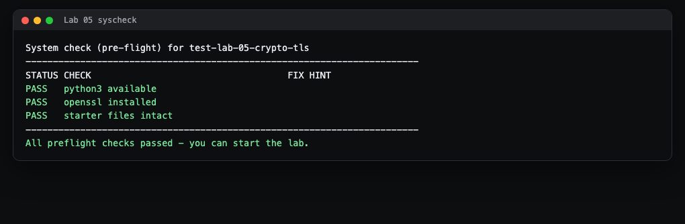
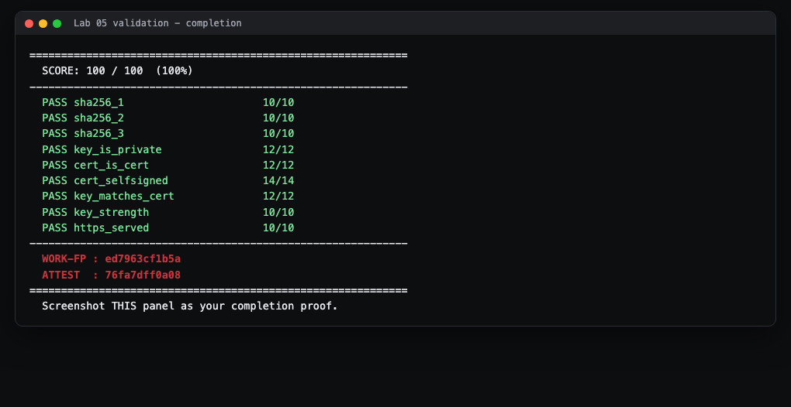

# Lab 5 Student Guide: Cryptography and TLS

**Course:** CSEC 2300-01 Foundations of Cyber Security (UIW) - Dr. Gonzalo D Parra

This guide is a friendly, click-by-click walkthrough. It does not hand you the
answers. It shows you the process and the tools so you can produce your own
correct results. Your inputs and digests are personalized to your repository, so
copying a classmate will never pass.

---

## What you will build and prove

You will show that you understand the three building blocks of modern security:

- **Hash:** a one-way fingerprint of some data. Same input always gives the same fixed-length output, and you cannot reverse it back to the input.
- **Key (keypair):** two linked numbers. A **private key** you keep secret, and a **public key** you can hand out. What one locks, only the other can unlock.
- **Certificate:** a signed document that wraps your public key together with an identity (a name), so others can trust that the key belongs to that name.

By the end you will have hashed three personalized strings, generated a real
keypair, issued a self-signed certificate for it, and served real HTTPS so a
grader can confirm the certificate on the wire matches the one you committed.

---

## Before you start

- **Where the official instructions live:** the Lab 5 assignment on Canvas links your private assignment repository and points to `README.md` in your repository. `HINTS.md` in the repository has a three-tier hint ladder if you get stuck.
- **What you need installed:** `openssl` and `git`. On Windows, install **Git for Windows**, which gives you **Git Bash**. Git Bash already includes `openssl`, `git`, and `sha256sum`. Run every command in this guide inside **Git Bash**, not the regular Windows Command Prompt.
- **Docker** is only needed for the last optional task (serving HTTPS). Install **Docker Desktop** if you want that final 10 points.

---

## Step 1 - Accept and open the lab

1. Accept the repository invitation GitHub emails you when your instructor adds you to your private repo. GitHub creates a private repository named for you.
2. Copy the repository URL (green **Code** button), then in Git Bash run:

   ```bash
   git clone <your-repo-url>
   cd <your-repo-folder>
   ```

   Replace the angle-bracket parts with your real values. `cd` means "change
   directory" (move into that folder).

> **what you'll see:** a new folder containing `README.md`, `HINTS.md`,
> `starter/`, and `autograde/`.

---

## Step 2 - Run the system check first

Always confirm your environment before doing any work:

```bash
bash autograde/run.sh --syscheck
```

> **what you'll see:**



Every row should say `PASS`. If a row says `FAIL`, fix it before continuing:

- **python3 available FAIL:** install Python 3 and reopen Git Bash so it is on your PATH.
- **openssl installed FAIL:** reinstall Git for Windows (it bundles openssl), or install openssl and reopen the terminal.
- **starter files intact FAIL:** you deleted or renamed a starter file. Re-clone the repository or restore the named file.

---

## Step 3 - See YOUR three hash inputs

Your inputs are unique to your repository. Print them with:

```bash
bash starter/show-inputs.sh
```

> **what you'll see:** three lines like `input 1: ...`, `input 2: ...`,
> `input 3: ...`, followed by a reminder of the hashing command. These three
> strings are yours. Do not use anyone else's.

---

## Step 4 - Compute the SHA-256 of each input

A hash is a fingerprint. You will fingerprint each of your three input strings
and record the results. **Hash the exact bytes with no trailing newline.** The
`printf '%s'` part below is what keeps the sneaky invisible newline out.

For each of your three inputs, run one of these (pick the tool you have):

```bash
printf '%s' "PASTE-ONE-INPUT-HERE" | sha256sum
```

or, equivalently:

```bash
printf '%s' "PASTE-ONE-INPUT-HERE" | openssl dgst -sha256
```

**Command anatomy:**

- `printf '%s' "..."` prints the string with no extra newline.
- `|` (pipe) feeds that output into the next command.
- `sha256sum` / `openssl dgst -sha256` computes the SHA-256 hex digest.

> **what you'll see:** a 64-character hex string. That is the digest for that
> one input.

Copy `starter/answers-template.yaml` to a new file named `answers.yaml` at the
repository root, and fill in `sha256_1`, `sha256_2`, and `sha256_3` with the
digest of input 1, input 2, and input 3 respectively:

```bash
cp starter/answers-template.yaml answers.yaml
```

Then open `answers.yaml` in any text editor and paste each digest inside the
quotes. Keep the quotes. Save the file.

> **common mistake:** hashing the wrong input, or letting an editor add a
> trailing newline. If a digest does not match, re-run `show-inputs.sh` and hash
> again with `printf '%s'` exactly as shown.

---

## Step 5 - Generate your keypair and self-signed certificate

Now create a real RSA keypair and a certificate for it. One `openssl` command
does both at once. Run this at the repository root:

```bash
openssl req -x509 -newkey rsa:2048 -nodes \
  -keyout key.pem -out cert.pem -days 365 \
  -subj "/CN=my-lab-server"
```

**Command anatomy:**

- `openssl req` runs the certificate-request tool.
- `-x509` says "skip the request step and issue a finished self-signed certificate."
- `-newkey rsa:2048` generates a brand new RSA key that is 2048 bits (this is the required strength; weaker keys fail grading).
- `-nodes` means "no DES," so the private key is saved unencrypted (fine for a throwaway lab key).
- `-keyout key.pem` writes the private key to `key.pem`.
- `-out cert.pem` writes the certificate to `cert.pem`.
- `-days 365` makes the certificate valid for one year.
- `-subj "/CN=my-lab-server"` sets the identity (Common Name). You may pick your own name here.

> **what you'll see:** a few lines of dots and plus signs (openssl working),
> then your prompt returns. Two new files exist: `key.pem` and `cert.pem`.

You now have two of the three deliverables. `key.pem` is your secret private
key. `cert.pem` binds its matching public key to the name you chose, and because
you signed it yourself the certificate is **self-signed** (subject equals
issuer).

> **Do not** commit real production keys. These are throwaway lab keys only.

---

## Step 6 - How to view (read) a certificate

You should be able to inspect what you made. These are read-only and safe:

```bash
# Human-readable dump of the whole certificate:
openssl x509 -in cert.pem -noout -text

# Just the identity (subject) and who signed it (issuer):
openssl x509 -in cert.pem -noout -subject -issuer

# The certificate fingerprint (a hash of the whole cert):
openssl x509 -in cert.pem -noout -fingerprint -sha256
```

> **what you'll see:** for a self-signed certificate, `subject` and `issuer`
> print the **same** name. The `-text` view shows `Public-Key: (2048 bit)`,
> which is the strength the grader wants.

---

## Step 7 (optional, Tier C) - Serve real HTTPS

This is the last 10 points. You start a tiny web server that speaks HTTPS using
your certificate, and the grader connects to it and checks that the certificate
on the wire is exactly the one you committed.

**The simplest way**, using openssl directly (leave this running in one Git Bash
window):

```bash
bash starter/serve-https.sh
```

That script runs `openssl s_server -accept 8443 -cert cert.pem -key key.pem
-www`. It listens for HTTPS on port `8443`.

**The container way**, if you prefer Docker (what a production edge looks like):

```bash
docker run -d --name lab05-tls -p 127.0.0.1:8443:8443 \
  -v "$PWD/cert.pem:/work/cert.pem:ro" \
  -v "$PWD/key.pem:/work/key.pem:ro" \
  alpine/openssl s_server -accept 8443 -cert /work/cert.pem -key /work/key.pem -www
```

**Command anatomy (the container version):**

- `docker run -d` starts a container in the background.
- `-p 127.0.0.1:8443:8443` publishes the container's port 8443 to your own machine's port 8443.
- `-v "$PWD/cert.pem:/work/cert.pem:ro"` mounts your certificate into the container, read-only.
- `alpine/openssl s_server ...` runs the same openssl HTTPS server inside the container.

**Confirm it works** from a second Git Bash window:

```bash
echo | openssl s_client -connect localhost:8443 -servername localhost 2>/dev/null \
  | openssl x509 -noout -fingerprint -sha256
```

> **what you'll see:** a `sha256 Fingerprint=...` line. It should be **identical**
> to the fingerprint from Step 6 (`openssl x509 -in cert.pem ...`). Identical
> fingerprints mean the server is presenting the exact certificate you committed.

When you are done, stop the server. For the script version press `Ctrl+C`. For
the container version:

```bash
docker rm -f lab05-tls
```

---

## Final step - Validate and capture your proof

Run the full autograder from the repository root:

```bash
bash autograde/run.sh
```

Read the per-criterion table. Each entry shows `points` out of `max` and a short
`feedback` line. Fix anything that is not full marks (the feedback tells you
what is wrong), then re-run.

At the bottom you will see a **WORK-FP** and an **ATTEST** value, plus your
total. **Take a screenshot of this result** showing the score, the WORK-FP, and
the ATTEST. That screenshot is your proof of completion.

> **A finished run looks like this:**



Then commit and push your work so it is saved on GitHub:

```bash
git add answers.yaml key.pem cert.pem
git commit -m "Lab 5 crypto and TLS"
git push
```

---

## Troubleshooting

- **A `sha256_N` line is wrong.** You hashed the wrong string or an editor added a hidden newline. Re-run `bash starter/show-inputs.sh`, then re-hash with `printf '%s' "input" | sha256sum` exactly. Do not type the input by hand if you can copy it.
- **`cert_selfsigned` or `key_matches_cert` shows "blocked by cert_is_cert".** Your `cert.pem` is missing or is not a real certificate. Re-run the Step 5 command and make sure `cert.pem` is at the repository root (not inside `starter/`).
- **`key_strength` fails.** Your key is weaker than 2048-bit RSA. Regenerate with `-newkey rsa:2048` (or use `ed25519`).
- **`https_served` says "no HTTPS server responding on 8443".** Your server is not running, or it is on a different port. Start it (Step 7), keep that window open, and re-run the grader in a separate window. This criterion safely **skips** if no server is up; it does not block your other points.
- **Windows: `openssl` or `sha256sum` "command not found".** You are in Command Prompt, not Git Bash. Open **Git Bash** and try again.
