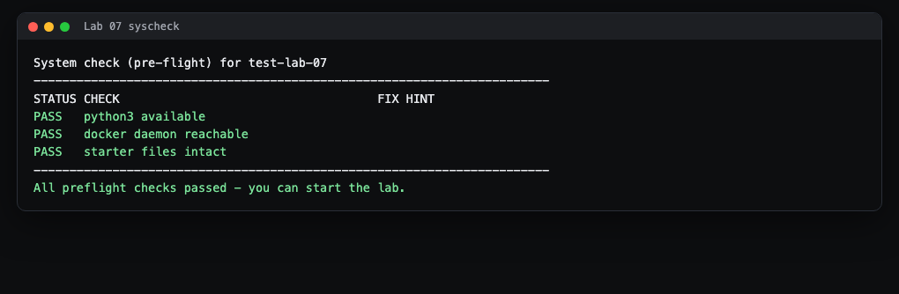
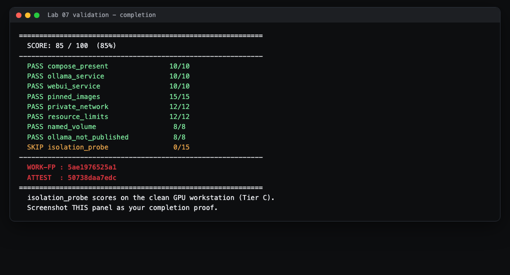

# Lab 7 Student Guide: Local LLM Stack (Ollama + Open WebUI)

Course: CSEC 2300 Foundations of Cyber Security (UIW) with Dr. Gonzalo D Parra

This guide walks you through the lab step by step. It assumes you have never
used Docker or the command line before. Read it top to bottom. The
authoritative task list lives in `README.md`; the hint ladder lives in
`HINTS.md`. This guide teaches the tools and the process, not the answers.

---

## 1. What you will build and prove

You will write one text file, `docker-compose.yml`, that stands up two
programs together:

- **Ollama**, an engine that runs AI language models on your own machine.
- **Open WebUI**, a web page (a chat window) that talks to Ollama.

The security goal: keep the AI engine **private**. Only the chat window is
allowed to reach the outside; the Ollama engine sits on an internal network
that nothing on your computer can touch directly. Running models locally like
this keeps data on-premises, which is a privacy and data-governance control
(course outcome CO4).

---

## 2. Before you start

**Prerequisites**

- A computer with **Docker Desktop** installed and running. On the GPU
  workstations in the lab this is already installed. On your own Windows
  machine, install "Docker Desktop" and open it once so the whale icon in the
  system tray stops animating (that means the engine is ready).
- The lab files, which you get from the **your GitHub assignment repository** invite link on
  Canvas.

**Where the real instructions live**

- `README.md` in this folder is the assignment: the exact tasks and the
  grading table.
- `HINTS.md` is a three-tier hint ladder. Tier 1 is a gentle nudge, Tier 3 is
  almost the answer. Use the lowest tier that unblocks you.

**A few words you will see a lot**

- **Docker** runs software inside a **container**: a sealed box with its own
  files and network, kept separate from the rest of your computer.
- **Docker Compose** is a way to describe several containers, and how they
  connect, in **one file** (`docker-compose.yml`) instead of typing many long
  commands. You describe the desired end state; Compose builds it.
- A **service** is one container definition inside that file (you will define
  two: `ollama` and `open-webui`).
- A **network** in Compose is a private lane that connects your services to
  each other. Containers on the same named network can call each other by
  name; anything not on that network cannot reach in.
- A **port** is a numbered door on a computer. `"8407:8080"` means "connect
  door 8407 on my computer to door 8080 inside the container." If a service
  has **no** ports line, it has no door to the outside and can only be reached
  from inside its private network. That is exactly what we want for Ollama.
- A **volume** is a named folder Docker keeps for you so downloaded model data
  survives even if the container is deleted and recreated.

---

## 3. Step 1: Accept and open the lab

1. Click the **your GitHub assignment repository** invite link on Canvas and accept it. This
   creates your personal copy (repository) of the lab.
2. Copy the green **Code** button URL from your new repository.
3. Open a terminal. On Windows this is **PowerShell** (press Start, type
   `PowerShell`, press Enter). Then clone and enter the folder:

```
git clone <paste-your-repo-URL-here>
cd lab-07-local-llm-stack
```

> what you'll see: git prints a few "Receiving objects" lines, then your
> prompt shows the new folder. Type `dir` (Windows) or `ls` (Mac/Linux) and
> you should see `README.md`, `HINTS.md`, an `autograde` folder, and a
> `starter` folder.

---

## 4. Step 2: Run the system check first

Before doing any work, confirm your machine is ready. Run:

```
bash autograde/run.sh --syscheck
```

> what you'll see:



Every row should say **PASS**. If a row says **FAIL**, fix it using the hint
in that row before continuing:

- **python3 available FAIL**: install Python 3 and reopen the terminal.
- **docker daemon reachable FAIL**: open Docker Desktop and wait for the whale
  icon to go solid, then re-run the check.
- **starter files intact FAIL**: you deleted or moved a starter file. Restore
  it (re-clone the repo into a fresh folder if needed).

Re-run the command until all rows PASS.

---

## 5. Step 3: Understand the starter, then write your compose file

Open `starter/docker-compose.skeleton.yml`. It is a **broken on purpose**
starting point. Read its comments: it uses `:latest` image tags, publishes
Ollama straight to the host, and has no private network, no limits, and no
named volume. Your job is to copy it up one level and harden it.

Copy it to the repo root (this becomes the file the grader reads):

```
cp starter/docker-compose.skeleton.yml docker-compose.yml
```

Now edit `docker-compose.yml` and work through the tasks in `README.md`. In
plain language, you must:

1. **Pin both images.** Replace every `:latest` with a specific version tag so
   you always get the exact same, known software. `README.md` and `HINTS.md`
   (Tier 2) name the two images to use. Never leave `:latest`; that is a
   supply-chain risk.
2. **Give Ollama a named volume** for its model directory `/root/.ollama`, so
   downloaded data is not lost.
3. **Create one private network** and attach **both** services to it.
4. **Remove Ollama's door to the host.** Delete the `ports:` line from the
   `ollama` service entirely. Open WebUI will still reach Ollama by name over
   the private network. This is the whole point of the lab.
5. **Publish only the WebUI.** Keep a `ports:` line on `open-webui` so you can
   open the chat page in a browser. On a shared machine, map it to a high host
   port so you do not collide with anyone else (this guide used host port
   **8407**). Never publish Ollama's `11434` to the host.
6. **Add a resource limit** to each service (a memory cap) so a runaway model
   cannot starve the machine.

`HINTS.md` Tier 3 shows the exact YAML shapes for volumes, networks, and
limits if you get stuck. Do not copy a full solution from a classmate; the
grader fingerprints your file.

> Tip: YAML cares about **spaces, not tabs**, and indentation must line up.
> Two spaces per level. If Compose complains about the file, an indentation
> slip is the usual cause.

Check that your file is well-formed before running anything:

```
docker compose config
```

> what you'll see: if the file is valid, Compose prints the fully expanded
> configuration back to you. If it is broken, it prints a red error naming the
> line to fix.

---

## 6. Step 4: Bring the stack up and read the output

Start both containers in the background. On a shared machine, give your stack
its own project name so it stays separate from other students' stacks:

```
docker compose -p csec2300-lab07 up -d
```

> what you'll see: Compose downloads each image (a stream of "Pull complete"
> lines the first time only), then:
>
> ```
> Network csec2300-lab07_llmnet   Created
> Volume  csec2300-lab07_ollama   Created
> Container csec2300-lab07-ollama-1      Started
> Container csec2300-lab07-open-webui-1  Started
> ```
>
> The `-d` means "detached": the containers keep running and your prompt comes
> back. The first `up` can take a few minutes while images download; later
> ones are fast.

Check what is running:

```
docker compose -p csec2300-lab07 ps
```

> what you'll see: two rows, both `Up`. Look at the PORTS column. Open WebUI
> shows something like `0.0.0.0:8407->8080/tcp` (published to the host).
> Ollama shows only `11434/tcp` with **no** `0.0.0.0:` in front. That missing
> `0.0.0.0:` is your proof Ollama has no door to the host. That is correct.

Open the chat page in a browser at `http://localhost:8407` (use the same host
port you published). You should see the Open WebUI welcome screen.

**See the isolation for yourself.** Ask Ollama for its version from *inside*
the WebUI container (allowed, same private network):

```
docker compose -p csec2300-lab07 exec open-webui curl -s http://ollama:11434/api/version
```

> what you'll see: a small `{"version": "..."}` reply. WebUI can reach Ollama
> by the name `ollama` because they share the private network. Now try the
> same thing from your host with `curl http://localhost:11434/...` and, for
> your own stack, it should not connect, because you never published that
> port. (On the shared classroom machine a separate campus Ollama may answer
> on 11434; that is not your container.)

You do **not** need to download any AI model for this lab. The grader only
checks that the services stand up and stay isolated, not that a model
answers questions. Keep it lightweight.

---

## 7. Final step: Validate and capture your proof

Run the grader:

```
bash autograde/run.sh
```

It prints a JSON report: one entry per grading criterion with `points` earned,
then two codes at the bottom, **WORK-FP** and **ATTEST**. Those codes
fingerprint your exact file and result. **A screenshot showing the criteria,
the total, and both codes is what you submit.**

> what a finished run looks like:



To make the screenshot: select the terminal output, or use your operating
system's screen capture (Windows: press `Windows + Shift + S`), and save the
image. Make sure the WORK-FP and ATTEST lines are visible.

**About the last criterion, `isolation_probe`.** This live network probe is
graded on the isolated lab GPU workstations, where your Open WebUI is the only
thing answering and there is no other Ollama on the machine. On a busy shared
computer it may report `0` or `skipped` because another program happens to be
using the ports it checks. That does not mean your file is wrong. As long as
your `ollama` service has no `ports:` line and the other eight criteria are
full marks (85 out of 85 on the static checks), your compose is correct. Your
instructor grades the isolation probe on the clean workstation.

When you are done, submit as `README.md` directs (push to your GitHub
assignment repo), and include your validation screenshot.

**Shut your stack down** so you leave the machine clean:

```
docker compose -p csec2300-lab07 down -v
```

> what you'll see: each container "Removed", then the network and volumes
> "Removed". The `-v` also deletes the named volumes.

---

## 8. Troubleshooting

- **"docker: command not found" or "Cannot connect to the Docker daemon."**
  Docker Desktop is not running. Open it and wait for the whale icon to go
  solid, then try again.
- **`up` fails with "port is already allocated".** Another program (or another
  student) is using your host port. Pick a different high host port for
  `open-webui` (for example `8408:8080`) and re-run `up`. Never switch to
  `8080` or `11434` on the host.
- **Compose error like "did not find expected key" or "mapping values are not
  allowed".** A YAML indentation problem. Check that every level is indented
  with spaces (not tabs) and that items line up. Run `docker compose config`
  to see the offending line.
- **`pinned_images` criterion is 0.** You still have a `:latest` tag somewhere,
  or an image with no tag at all. Give every `image:` a specific version.
- **`ollama_not_published` criterion is 0.** Your `ollama` service still has a
  `ports:` line publishing `11434`. Delete that line completely; WebUI reaches
  Ollama over the private network, not through the host.
- **The chat page will not load at `localhost:8407`.** Give Open WebUI a minute
  after `up` to finish starting, then refresh. Confirm the container is `Up`
  with `docker compose -p csec2300-lab07 ps`.
