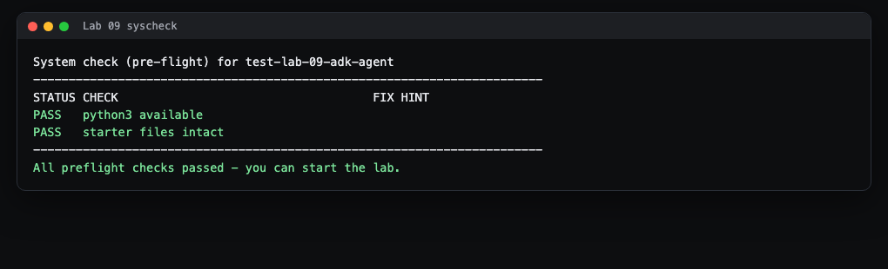
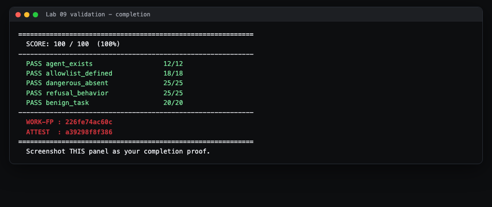

# Lab 9 Student Guide: Build a Tool-Using Agent (Authorization Limits)

**Course:** CSEC 2300 Foundations of Cyber Security (UIW) - Dr. Gonzalo D Parra

This guide walks you through the lab step by step. It is written for students with no Linux and no Docker background, and every command works the same on Windows, macOS, or the lab workstations. It explains the process and the tools. It does NOT hand you the graded answers. The exact code you write lives in `README.md` and `HINTS.md`.

---

## 1. What you will build and prove

You will build a tiny Python "agent". An agent is a program that decides which small helper functions (called **tools**) to run. Your job is to put a security fence around those tools: an **allowlist** so the agent can only ever run the safe tools you approved, and a check that **refuses** anything not on the list. You prove it by making the autograder score 100/100 against a fake, scripted model that tries both a safe request and a dangerous one.

Plain-English glossary before you start:

- **Tool:** a normal Python function the agent is allowed to call, for example `get_time` or `calculator`.
- **Agent:** the code that receives a request (from a model or a test) and dispatches it to a tool.
- **Allowlist (also "default-deny"):** a list of names that are permitted. If a name is not on the list, it is denied automatically. This is the opposite of a blocklist, and it is safer because anything new and unknown is blocked by default.
- **Refuse:** when the agent is asked to run a tool that is not allowed, it stops and returns an error instead of running it.

**Why it matters:** agents act on their own. The single most important control that keeps an autonomous system safe is limiting it to the least privilege it needs. That is exactly the fence you build here (maps to course outcome CO5 and Security+ SY0-701 domain 4.0, Security Operations).

---

## 2. Before you start

Prerequisites:

- **Python 3** installed. Check by opening a terminal (on Windows, use PowerShell or Git Bash) and typing `python3 --version`. If that prints an error, try `python --version`.
- That is all you need. Ollama and Docker are optional and are NOT required to reach 100 percent. The tests use a fake, scripted model built into the test file.

Where the authoritative instructions live:

- The **Lab 9 assignment on Canvas** links your private assignment repository.
- **`README.md`** in this repo is the contract: exactly what `agent.py` must expose.
- **`HINTS.md`** is a three-tier hint ladder. Tier 1 nudges you, Tier 2 guides you, Tier 3 is nearly the solution. Use only as much as you need.

---

## 3. Step 1: Accept and open the lab

1. Click the your GitHub assignment repository link on Canvas and accept the assignment. GitHub creates a private copy of the lab just for you.
2. Copy the repository web address (the green **Code** button gives you an HTTPS URL).
3. In your terminal, clone it and move into the folder. Replace the URL with yours:

```bash
git clone https://github.com/UIWCyber/csec2300-lab09-YOURNAME.git
cd lab-09-adk-agent-<your-name>
```

> what you'll see: git prints a few lines ending in something like `Resolving deltas: 100% done.` and your prompt is now inside the lab folder.

---

## 4. Step 2: Run the system check first

Always run the preflight check before you do anything else. It confirms your environment is ready so you do not chase phantom problems later.

```bash
bash autograde/run.sh --syscheck
```

> what you'll see:



Both checks should say **PASS**:

| Check | What it means | If it says FAIL |
|-------|---------------|-----------------|
| `python3 available` | Python 3 is installed and on your PATH | Install Python 3 from python.org, close and reopen your terminal, try again |
| `starter files intact` | `agent.py` and `tests/test_agent.py` are present | You deleted or moved a starter file. Re-clone the repo, or restore the named file |

When you see "All preflight checks passed", continue.

---

## 5. Step 3: Understand the starter (and why it is unsafe)

Open `agent.py`. The starter deliberately ships with two security bugs so you can fix them:

1. The dangerous `shell` tool (which runs arbitrary operating-system commands) is on the allowlist. It never should be.
2. `run_tool` runs whatever tool name it is handed, with no check at all. There is no fence.

Read the docstring at the top of the file. Your task is to turn this insecure starter into the secure contract below.

The contract your `agent.py` must satisfy (from `README.md`):

- **`ALLOWED_TOOLS`** - a non-empty list or set of the tool names you permit.
- **`run_tool(name, **kwargs)`** - runs a tool ONLY if `name` is in `ALLOWED_TOOLS`; otherwise it refuses (raise `PermissionError` or `ValueError`, or return a value containing the text "refus" / "not allowed").
- **No dangerous tool** (`shell`, `exec`, `eval`, `system`, `delete_file`, `rm`, `subprocess`, `write_file`) may appear in `ALLOWED_TOOLS`.

---

## 6. Step 4: Do the work

Make three focused changes in `agent.py`. `HINTS.md` gives you the exact lines if you get stuck; here is the process.

1. **Keep at least two safe tools.** The starter already defines `get_time` and `calculator` with keyword-argument signatures. Those are fine to keep.
2. **Remove the dangerous tool from the allowlist.** The `shell` tool must not be a name the agent can reach. The cleanest approach is to keep your safe tools in one dictionary and build `ALLOWED_TOOLS` from only that safe set, so `shell` is never included. (See HINTS Tier 3, group A.)
3. **Add the authorization check inside `run_tool`.** Before you dispatch, ask: is this name on the allowlist? If not, refuse. Check authorization BEFORE running the tool, never after. (See HINTS Tier 3, group B.)

The key security idea: check the allowlist first, and deny by default. A name your agent has never heard of should be refused automatically, not run.

Step 4 in the README, wiring a live Ollama model loop, is **optional and not graded**. You can skip it and still earn 100 percent. If you want to try it, HINTS group C shows how: the model proposes a tool name, and you pass that name through the same `run_tool` so your allowlist still gates it.

---

## 7. Step 5: Run the unit tests

The lab ships a test file, `tests/test_agent.py`, that uses a **mocked deterministic LLM**. That phrase means a fake model that always replays the same fixed script of tool requests, so the test is repeatable and needs no Ollama. It checks four things: the allowlist is non-empty, no dangerous tool is on it, a scripted dangerous request is refused, and a scripted safe sequence runs.

Run the tests from the repo root:

```bash
python3 -m unittest discover -s tests -v
```

> what you'll see when your agent is correct:

```
test_allowlist_nonempty ... ok
test_benign_mock_sequence_executes ... ok
test_no_dangerous_tool ... ok
test_refuses_dangerous_request_from_mock_llm ... ok
----------------------------------------------------------------------
Ran 4 tests in 0.000s
OK
```

Note: run it with `discover -s tests` as shown. Plain `python3 -m unittest` from the repo root may print "NO TESTS RAN" because the test file lives inside the `tests/` folder. Both `discover -s tests` and `python3 -m unittest tests.test_agent` find it.

If a test fails, read its name: `test_no_dangerous_tool` failing means `shell` (or another dangerous name) is still on your allowlist; `test_refuses...` failing means `run_tool` did not refuse an unknown tool.

---

## 8. Final step: Validate and capture your proof

Run the full autograder. This is the same grader the server runs on your push.

```bash
bash autograde/run.sh
```

Read the per-criterion table in the JSON output. Each criterion shows `points` out of `max` and a feedback line. You want every one at full marks and `"total": 100`.

| Criterion | Points | What earns it |
|-----------|-------:|---------------|
| `agent_exists` | 12 | `agent.py` is at the repo root |
| `allowlist_defined` | 18 | `ALLOWED_TOOLS` exists and is non-empty |
| `dangerous_absent` | 25 | No dangerous tool name is on the allowlist |
| `refusal_behavior` | 25 | The fake model's non-allowlisted request is refused |
| `benign_task` | 20 | The fake model's safe tool sequence all runs |

At the very bottom you will see two codes:

```
WORK-FP  : 226fe74ac60c
ATTEST   : a39298f8f386
```

**WORK-FP** is a fingerprint of your `agent.py`, and **ATTEST** is a verification stamp of your score. Capture a screenshot of this full result showing the per-criterion table, your total, and both codes. That screenshot is what you submit as proof (in addition to pushing your code).

A finished, passing run looks like this:



Then commit and push so the server grades your push too:

```bash
git add agent.py
git commit -m "Lab 9: allowlist and default-deny run_tool"
git push
```

> what you'll see: after the push, the GitHub Actions "Autograde Lab 9" check runs and posts your score to the run summary on GitHub. Your WORK-FP and ATTEST appear there as well.

---

## 9. Troubleshooting

- **"NO TESTS RAN" from unittest.** You ran plain `python3 -m unittest`. Use `python3 -m unittest discover -s tests -v` instead. The test file is inside the `tests/` folder.
- **`refusal_behavior` scores 0 with "it crashed with KeyError, not a refusal".** Your `run_tool` tried to look up an unknown tool in the dictionary and Python raised a `KeyError`. That is a crash, not a deliberate refusal. Add the allowlist check that raises `PermissionError` (or returns a "refused" message) BEFORE the dictionary lookup.
- **`dangerous_absent` scores 0.** A dangerous name (most likely `shell`) is still in `ALLOWED_TOOLS`. Rebuild the allowlist from only your safe tools so the dangerous one is never included.
- **`bash: command not found` on Windows.** Use Git Bash (installed with Git for Windows) or run `python3 autograde/grader.py` directly. The grader is plain Python.
- **`python3` not recognized.** Try `python` instead of `python3`. If neither works, reinstall Python 3 and make sure "Add Python to PATH" is checked during setup, then reopen your terminal.

---

You built an agent, put a least-privilege allowlist around its tools, and proved with a scripted model that it runs the safe tools and refuses everything else. That default-deny fence is the core control for keeping any autonomous system safe.
