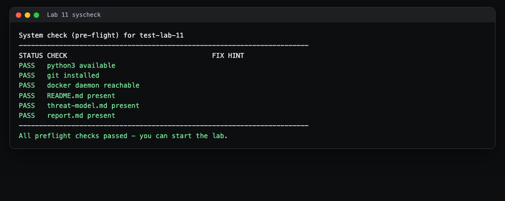
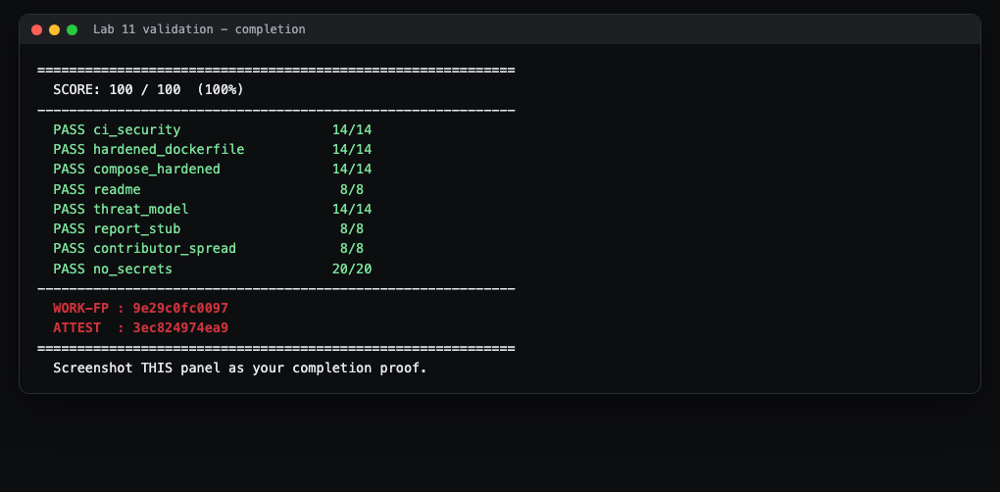

# Lab 11 Student Guide: Capstone Integration

**CSEC 2300 Foundations of Cyber Security** | Instructor: Dr. Gonzalo D Parra

## What you will build and prove

This lab is where your capstone comes together. You take the pieces your team
already built in earlier labs (a security CI pipeline, a hardened Dockerfile, an
isolated compose stack) and assemble them into one team repository, then add the
written deliverables: a STRIDE threat model and a wiki-ready report. The
autograder does static checks over your repository and returns a score plus two
verification codes (WORK-FP and ATTEST). That score panel is what you submit as
proof.

There is nothing new to invent here. Almost every point comes from work you have
done before. Lab 11 is about pulling it into a clean, gradable whole.

## Before you start

- The authoritative instructions live in two places: the **Lab 11 assignment on
  Canvas** (repository invitation plus the repository `README.md`) and
  **`HINTS.md`** in the repository, which gives a three-tier hint ladder if you
  get stuck. Read both before you touch anything.
- This lab is graded on your **team capstone repository**, not a personal one.
  The whole capstone is described in the **Capstone Document Pack** at
  `capstone/` in the course materials. Two documents there matter most for this
  lab:
  - `capstone/readiness-checklist.md` is a self-audit whose items line up almost
    one for one with the autograder criteria. Treat it as your pre-submit list.
  - `capstone/proposal-template.md` is the plan your team submitted for approval;
    it names the stack and the controls you are now proving.
- You need Git, Docker Desktop, and Python 3 installed. The system check in
  Step 2 confirms this for you.

## Step 1: Accept and open the lab

Accept the repository invitation from Canvas. It creates your team repository.
Clone it and change into it. On Windows, run these in **Git Bash** (installed
with Git for Windows), not the classic Command Prompt, so the `bash` commands in
this guide work.

```bash
git clone https://github.com/<your-org>/<your-team-repo>.git
cd <your-team-repo>
```

> what you'll see: a folder with `README.md`, `HINTS.md`, `threat-model.md`,
> `report.md`, and an `autograde/` folder. Those last two markdown files are
> starters full of the word TODO. Your job is to replace them and add the
> container and CI files.

## Step 2: Run the system check first

Always run the preflight before doing any work. It tells you whether your
machine has what the lab needs.

```bash
bash autograde/run.sh --syscheck
```

> what you'll see: a table like the completed run below. Every row should say
> PASS before you continue.



How to fix a FAIL:

- **python3 available** fails: install Python 3 from python.org and reopen your
  terminal so it is on your PATH.
- **git installed** fails: install Git for Windows, then reopen the terminal.
- **docker daemon reachable** fails: open Docker Desktop and wait until it says
  the engine is running, then re-run the check.
- **README.md / threat-model.md / report.md present** fails: you are in the
  wrong folder, or a starter file was deleted. Run `ls` and make sure you are at
  the top of the repository.

## Step 3: Bring the CI pipeline into the repo

The grader wants one workflow file under `.github/workflows/` (any name except
`classroom.yml`) that runs three kinds of security check on every push: a
**linter**, a **secret scanner**, and a **dependency audit**. You built exactly
this in the earlier CI lab. Copy that workflow in and confirm it still names all
three stages. `HINTS.md` group A lists the tool families the grader recognizes.

> what you'll see: after you push, the **Actions** tab on GitHub shows your
> workflow running. A green check means the pipeline passed. The grader itself
> only reads the file, so it counts even before the run finishes, but a green
> Actions tab is what the readiness checklist asks for.

## Step 4: Add the hardened Dockerfile and compose stack

These also come from earlier labs. Two files, two sets of rules.

`Dockerfile` must be hardened. Read your file and confirm three things with a
quick search:

```bash
grep -E '^(FROM|USER|HEALTHCHECK)' Dockerfile
```

> what you'll see: a `FROM` line pinned to a real version (never `:latest`), a
> `USER` line that is not root, and a `HEALTHCHECK` line. If any is missing, add
> it. `HINTS.md` group A tier 3 lists what the grader looks for.

`docker-compose.yml` must be isolated and pinned. Check it the same way:

```bash
grep -nE 'image:|ports:|mem_limit|cpus:' docker-compose.yml
docker compose config
```

> what you'll see: every `image:` pinned to a version (no `:latest`), a resource
> limit on each service (`mem_limit` or `cpus`), and the model runtime with **no**
> `ports:` line so it is never published to your host. Only the reverse proxy
> should publish a port. `docker compose config` printing your stack with no
> error means the file parses.

To prove the stack really runs, build and start it. Use your team's project name
and keep the published port off the common defaults:

```bash
docker compose -p <your-team> up -d --build
```

> what you'll see: Docker builds your image and starts the services. Once they
> are healthy you can reach the proxy in a browser at the port you published.
> When you are done, tear it down cleanly so nothing is left running:
> `docker compose -p <your-team> down -v`.

## Step 5: Write the threat model

Open `threat-model.md`. The starter has a STRIDE table where every cell says
TODO. Replace all of it. The grader needs three things and will not award the
points until the word TODO is gone:

1. an **Assets** section listing what you are protecting (models, the data
   volume, secrets, endpoints),
2. a **STRIDE** table covering all six categories (Spoofing, Tampering,
   Repudiation, Information disclosure, Denial of service, Elevation of
   privilege), and
3. a real **mitigation** for each row.

`HINTS.md` group B walks the structure. Write about your own stack: tie each
threat and mitigation to the containers and controls you actually built. Do not
leave a single TODO.

## Step 6: Complete the report

Open `report.md`. It is a wiki-ready stub with five headings, each followed by
TODO. Fill in all five: **Overview, Architecture, Controls, Findings, Next
Steps**, and remove every TODO. Keep the headings as headings (lines that start
with `#`) so the grader can find them. This is the text you will paste into your
GitHub Wiki for the final report. `HINTS.md` group C describes each section.

While you are here, make sure no secrets ever land in the repository. Scan the
tree before you commit:

```bash
grep -R -nE "BEGIN .*PRIVATE KEY|API_KEY=sk-" .
```

> what you'll see: nothing. An empty result is good. If it prints a file, remove
> the secret, put it behind `.gitignore` or Docker secrets, and never commit it.

## Step 7: Commit as a team

One grading criterion checks that commits come from **more than one team
member**. Each member should commit their own work under their own Git identity
across the semester, not have one person commit everything at the end. You can
confirm the spread with:

```bash
git shortlog -sne
```

> what you'll see: every team member listed with a commit count. If only one
> name appears, the grader flags your repository for instructor review of
> contribution spread.

## Final step: Validate and capture your proof

From the top of your repository, run the full autograder:

```bash
bash autograde/run.sh
```

Read the per-criterion table. Each line shows the points you earned and a short
reason. Fix any criterion that is not full, using the feedback line and
`HINTS.md`, then run it again. A finished run looks like this:



The bottom of the output prints two codes:

```
WORK-FP  : <twelve characters>
ATTEST   : <twelve characters>
```

**Take a screenshot of this result panel showing the per-criterion table, your
percentage, the WORK-FP, and the ATTEST codes.** That screenshot is what you
submit as proof of a finished run. Follow the submission instructions on the
Canvas assignment for where to upload it.

Before you call the capstone done, walk `capstone/readiness-checklist.md` line
by line. Its items mirror this rubric and add the live checks the static grader
cannot see (CI green on HEAD, TLS at the edge, a guarded agent, the wiki report,
and a current Project board). Anything red there is your final-sprint task list.

## Troubleshooting

- **The grader gives zero for `threat_model` or `report_stub` even though the
  file looks full.** You almost certainly left the word TODO somewhere. Both
  checks require zero TODO markers. Search the file for `TODO` and clear every
  one.
- **`compose_hardened` stays at zero.** An image is still on `:latest`, or a
  service has no resource limit. Every `image:` needs a real version tag, and
  each service needs `mem_limit` or `cpus`. Re-run the `grep` from Step 4.
- **`hardened_dockerfile` stays at zero.** The last `USER` is still root, the
  `HEALTHCHECK` is missing, or a `FROM` is unpinned. Check all three with the
  Step 4 `grep`.
- **`ci_security` stays at zero.** Your workflow is missing one of the three
  stages, or your only workflow is `classroom.yml`, which the grader ignores on
  purpose. Make sure a second workflow file names a linter, a secret scanner,
  and a dependency audit.
- **`contributor_spread` is skipped or flagged.** The grader saw no Git history
  or only one author. Make sure you cloned a real repository with commits and
  that more than one teammate has committed under their own identity.
